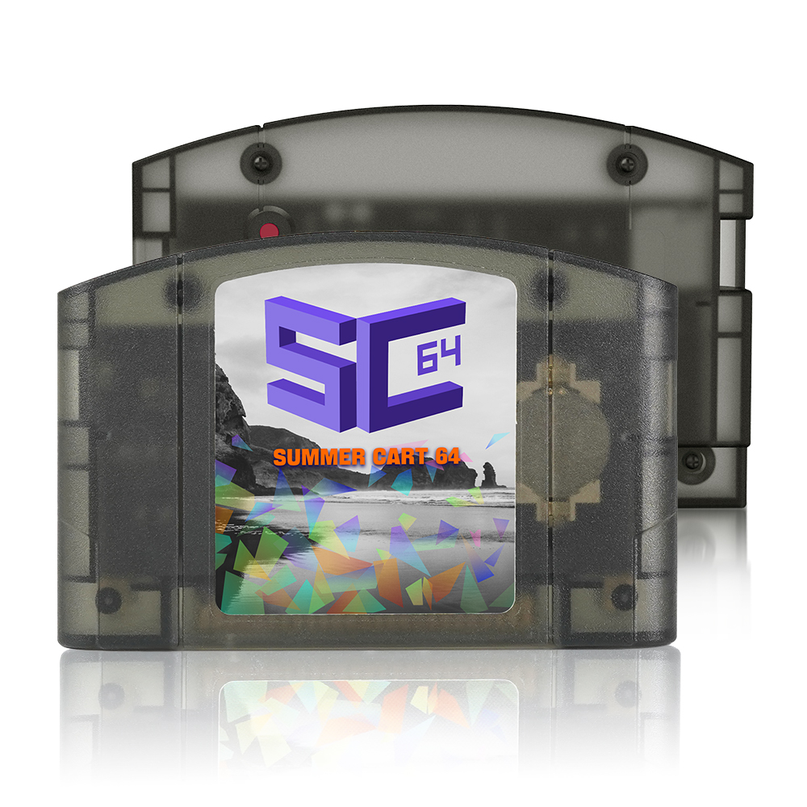
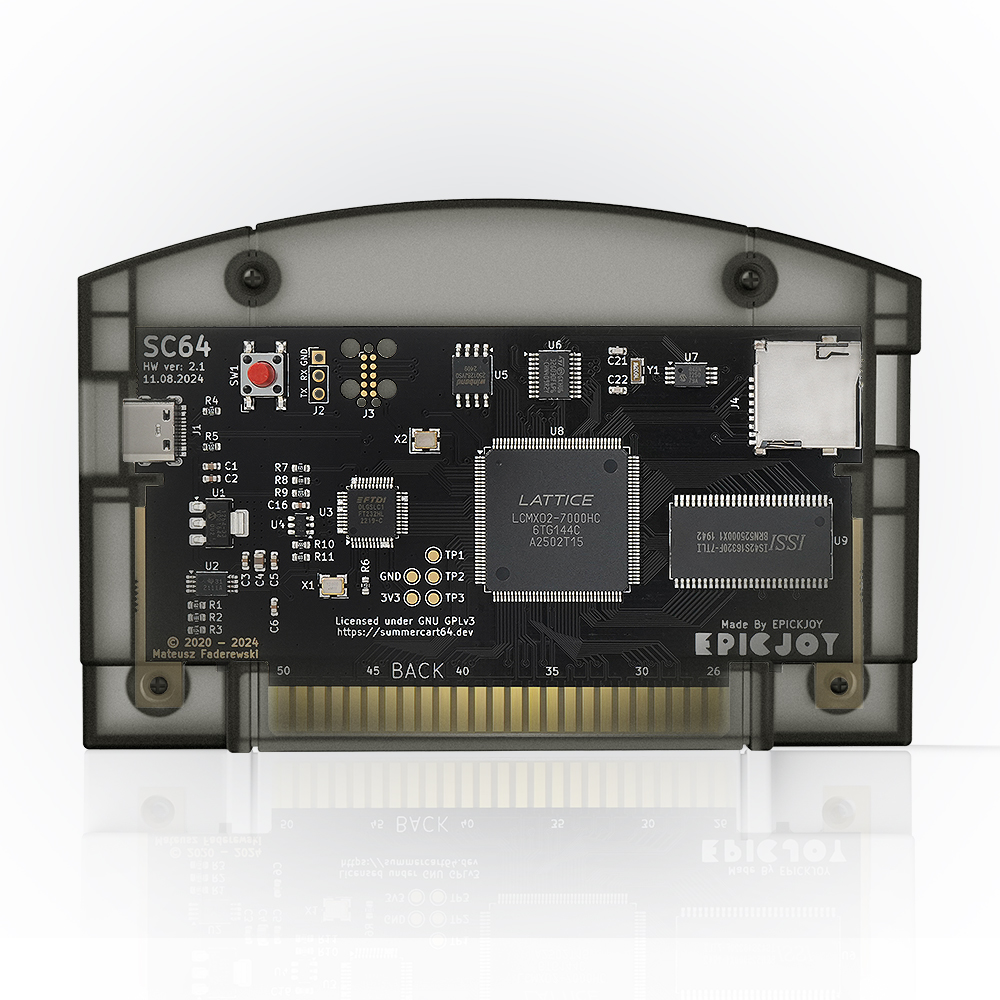

# SummerCart64 - a fully open source N64 flashcart

This project's hardware and casing are modified based on the [SummerCart64](https://github.com/Polprzewodnikowy/SummerCart64) project.

### Description

Experience classic gaming in a new way! SummerCart64 is a fully open-source flash cartridge designed for the Nintendo 64 (N64), perfect for both gamers and developers. Whether you want to relive your childhood memories or develop your own homebrew games, SummerCart64 has you covered.

### Features

-   **Extremely high game compatibility:** Supports N64 games up to 64MB (512Mb), covering the entire N64 game library
-  **Fast I/O**: Supports fast data transfer to ensure smooth gaming experiences，Thanks to a peak transfer rate of approximately 23.8 MiB/s, loading a maximum size game of **64MB** (512Mb) takes roughly 2.7 seconds under optimal conditions
- **RTC Functionality**: Built-in Real-Time Clock (**RTC**) to support games that require time functions.
-  **High-Capacity SD Card Support**: Supports microSD cards up to 2TB, allowing you to store more games and files.
-  **64DD Hardware Emulation**: It can play disk dumps directly! Combo games (N64 cartridge + 64DD disk) and multi-disk 64DD games are also supported.
- **Automatic Save Backup**: Automatically backs up saves during gameplay to protect your progress.
-  **Multi-Region Support**: Compatible with all region N64 consoles, eliminating region lock concerns.
-  **Enough space for your ROMs**: Equipped with **64 MiB SDRAM** and **16 MiB flash** memory to ensure smooth game operation.
-  **Easy Game Management**: Browse, run, and manage your game library directly on your N64 console with the intuitive N64FlashcartMenu.
-  **Full control of boot process:** perfect for trying out custom **IPL3** replacements giving you control right after N64 boots up

### Example

